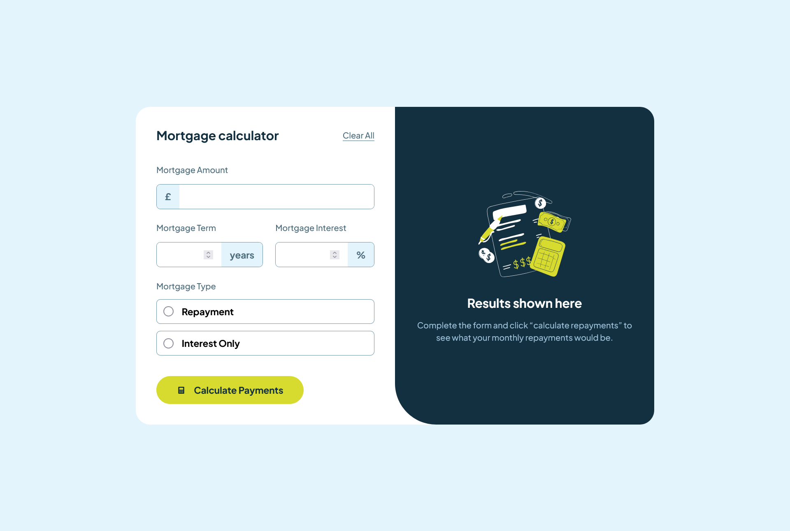

# Frontend Mentor - Mortgage repayment calculator solution

This is a solution to the [Mortgage repayment calculator challenge on Frontend Mentor](https://www.frontendmentor.io/challenges/mortgage-repayment-calculator-Galx1LXK73). Frontend Mentor challenges help you improve your coding skills by building realistic projects.

## Table of contents

- [Overview](#overview)
  - [The challenge](#the-challenge)
  - [Screenshot](#screenshot)
  - [Links](#links)
- [My process](#my-process)
  - [Built with](#built-with)
  - [What I learned](#what-i-learned)
  - [Continued development](#continued-development)
  - [Useful resources](#useful-resources)
- [Author](#author)
- [Acknowledgments](#acknowledgments)

## Overview 👓

### The challenge 💪

Users should be able to:

- Input mortgage information and see monthly repayment and total repayment amounts after submitting the form ✅
- See form validation messages if any field is incomplete ✅
- Complete the form only using their keyboard ✅
- View the optimal layout for the interface depending on their device's screen size ✅
- See hover and focus states for all interactive elements on the page ✅

[[back to top](#table-of-contents)]

### Screenshot



### Links 🔗

- Solution URL: [Repo](https://github.com/marcfranciss/Mortgage-repayment-calculator)
- Live Site URL: [Live](https://marcfranciss.github.io/Mortgage-repayment-calculator)

[[back to top](#table-of-contents)]

## My process 📖

### Built with

- Semantic HTML5 markup
- Sass
- Flexbox
- [React](https://reactjs.org/) - JS library
- [Typescript](https://www.typescriptlang.org/docs/)
- [Vite](https://vitejs.dev/guide/)
  ```
  npm create vite@latest
  ```
- [Sass](https://sass-lang.com/install/) - For styles

  ```
  npm install -g sass
  ```

### What I learned 📖

**[ 1 ] Calculate Mortgage Function**

I learned how to create a function that calculate morgage, see below:

```js
function calculateMortgage(amount: number, interest: number, year: number) {
  const monthlyInterestRate = interest / 100 / 12;
  const numberOfPayments = year * 12;
  const monthlyPayment =
    (amount *
      monthlyInterestRate *
      Math.pow(1 + monthlyInterestRate, numberOfPayments)) /
    (Math.pow(1 + monthlyInterestRate, numberOfPayments) - 1);

  const interestOnly = amount * monthlyInterestRate;
  const totalPayment = monthlyPayment * numberOfPayments;
  const formattedMonthlyPayment = monthlyPayment.toFixed(2);
  const formattedInterestOnly = interestOnly.toFixed(2);
  const formattedTotalPayment = totalPayment.toFixed(2);

  return {
    formattedMonthlyPayment,
    formattedTotalPayment,
    formattedInterestOnly,
  };
}
```

**[ 2 ] Async Await - Delay Function**

To create an async await delay function which will sync with the loading animation

```js
function delay(time: number) {
  return new Promise((res) => {
    setTimeout(res, time);
  });
}
delay(1000); // This is used in Loader component as 'timer: number'
```

**[ 3 ] Reset Button**
This is inside the 'Form' component and is triggered by 'onReset' props from the 'Calculator' component.

**_Note:_** Still unsure if this is the best way to do this. Any advice will be greatly appreciated.

```js
useEffect(() => {
  if (onReset) {
    // resets the data to blank
    setMortgageData({
      amount: "",
      year: "",
      interest: "",
      type: "",
      mMonthly: "",
      mInterestOnly: "",
      mTotal: "",
    });
    // resets the errors to false, so it will not show
    setErrors({
      amount: false,
      year: false,
      interest: false,
      type: false,
    });
    // returns reset button to default state
    setReset(false);
  }
}, [onReset]);
```

**[ 4 ] Custom Radio Button**

Created so that the correct radio button style is achieved

```scss
$clr-primary: rgb(216, 219, 47);
$clr-primary-accent: rgb(216, 219, 47, 15%); // see _colors.scss

/* Default state*/
.radio-cntnr {
  .lbl-radio {
    position: relative;
    width: 20px;
    height: 20px;
    padding-block: 12.5px;
    padding-inline: 1rem;
    color: $clr-slate-900;
  }
}
/* When checked or selected */
.radio-cntnr:has(:checked) {
  border-color: $clr-primary;
  background: $clr-primary-accent;
  .lbl-radio {
    accent-color: $clr-primary;
  }
  /* Created a new radion button style*/
  .lbl-radio:after {
    content: "";
    position: absolute;
    width: 20px;
    height: 20px;
    top: 0;
    left: 0;
    border-radius: 50%;
    border: 4px solid white;
    outline: 1px solid $clr-primary;
    background: $clr-primary;
  }
}
```

### Continued development 📖

I am still unsure of the best way or practices for creating reset buttons for forms. As well as manipulation of input data, like adding a comma for thousands and converting it back to a number, then converting it back to a string for the visualization of the result.

Here is a simple solution to achieve it for now:

```js
/* Convert it directly to with comma after or during change*/
<input
  type='text'
  value={mortgageData.amount}
  onChange={(e) =>
    setMortgageData({
      ...mortgageData,
      amount: e.target.value
        .replace(/\D/g, "")
        .replace(/\B(?=(\d{3})+(?!\d))/g, ","),
    })
  }
/>
```

```js
/* converts it back to number and replace all comma */
const amount: number = Number(mortgageData.amount.replace(/,/g, ""));
```

[[back to top](#table-of-contents)]

## Author 👓

- Website - [MackersDev](https://www.mackersdev.net)
- Frontend Mentor - [@marcfranciss](https://www.frontendmentor.io/profile/marcfranciss)
- LinkedIn - [LinkedIn](https://www.linkedin.com/in/marcfrancissurban/)

[[back to top](#table-of-contents)]

## Acknowledgments 📖

Thank you for taking the time in checking this project. 💕

I hope this somehow help you in what you're looking for. Cheers! 🍻
